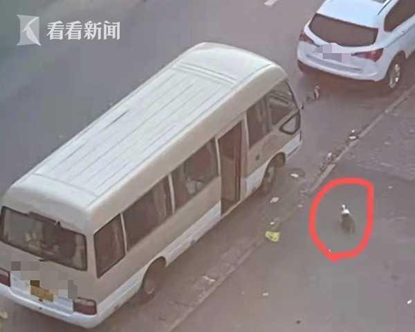
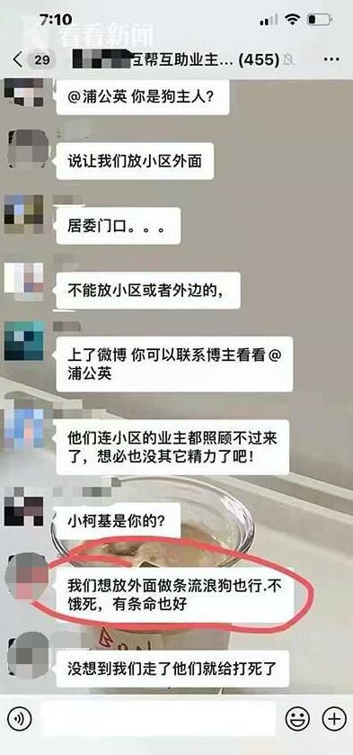

4月6日傍晚，网上热传一则消息并配有现场照片、视频：在上海浦东曹路一小区，网友爆料疑似一位养柯基犬的主人被带走隔离，狗狗追了出来，被工作人员拿铁锹拍几下后一动不动，最后疑似拿塑料袋拎走处理。拍摄者录视频时说“太残忍了”。

---

对此，居委会回应：工作人员称，因为这家有阳性病例，当时担心宠物狗会传染。当时确实考虑的不是非常周全，之后会和宠物狗主人进一步沟通，会给予对方赔偿。

而当晚7时许，这位柯基主人也在小区业主群里回应：“我是小狗主人，我们没有不要”，“家里没有狗粮了，抱出来是让居委照顾的，结果居委不管”，“我们想放外面做条流浪狗也行，不会饿死，有条命也好，没想到我们走了他们就给打死了。”

